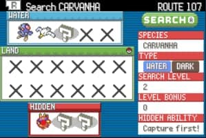

# Summary

- Tiene "Estados" de menú
- La estructura ``DexNavSearch`` contiene todos los parametros asociados a la **gestión lógica** del proceso. Además, la estructura `DexNavGUI`contiene los paramtros asociados al estado, cursor y algunos sprites de la GUI, como los iconos de *typing* o las cajas de especies.
  - Naturalmente esto supone que la gestión de la GUI y Search son gestionadas por dos variables de EWRAM distintas
  - Utiliza multiples variables de la EWRAM. Basta con declarar que el archivo en cuestión hace uso de la EWRAM una sola vez para que pueda usar más de una.

- La estructura principal de `DexNav` consiste en:
  - ``GUI``
  - ``SEARCH``
  - `IMAGE DATA`
  - `STRINGS`

# Inicialización:

``` C
static bool8 StartMenuDexNavCallback(void)
{
    /*
        Esta es la función que se ejecuta desde el "start menu". Se emplea una 
        task que permite "almacenar" la función para retornar tras salir del 
        menú
    */
    CreateTask(Task_OpenDexNavFromStartMenu, 0);
    return TRUE;
}

void Task_OpenDexNavFromStartMenu(u8 taskId)
{
    if (!gPaletteFade.active)
    {
        /*
            - Quita de la memoria todos los tiles
            - Inicializa el dexnav entregando el callback de retorno como 
            parametro
            - Destruye la tarea anterior para quitarlo de la memoria
        */
        CleanupOverworldWindowsAndTilemaps();
        DexNavGuiInit(CB2_ReturnToFieldWithOpenMenu);
        DestroyTask(taskId);
    }
}

static void DexNavGuiInit(MainCallback callback)
{
    /*
        - Reserva espacio para la data del menú
            - Si falla, retorna al overworld teniendo el menú de pausa
            abierto
        - Si todo está en orden, setea los valores iniciales y corre el
        set up del menú
    */
    if ((sDexNavUiDataPtr = AllocZeroed(sizeof(struct DexNavGUI))) == NULL)
    {
        SetMainCallback2(callback);
        return;
    }
    
    sDexNavUiDataPtr->state = 0;
    sDexNavUiDataPtr->savedCallback = callback;
    SetMainCallback2(DexNav_RunSetup);
}

static void DexNav_RunSetup(void)
{
    while (!DexNav_DoGfxSetup()) {} // ???
}
```

# Uso de `WindowTemplates`:

1) `sDexNavGuiWindowTemplates`
    <p align="center">
        
    </p>

``` C

static const struct WindowTemplate sDexNavGuiWindowTemplates[] =
{
    [WINDOW_INFO] =
    {
        /*
            Datos del Pokemon
        */
        .bg = 0,
        .tilemapLeft = 21,
        .tilemapTop = 5,
        .width = 9,
        .height = 15,
        .paletteNum = 15,
        .baseBlock = 1,
    },
    [WINDOW_REGISTERED] =
    {
        /*
            SEARCH CARVAHNA
        */
        .bg = 0,
        .tilemapLeft = 4,
        .tilemapTop = 0,
        .width = 26,
        .height = 2,
        .paletteNum = 15,
        .baseBlock = 200,
    },
    DUMMY_WIN_TEMPLATE
};
```

# Carga de Sprites: `Cursor`

``` C
/*
    Referenciamos el sprite del cursor comprimido de 32x32 pixeles
*/
static const u32 sSelectionCursorGfx[] = INCBIN_U32("graphics/dexnav/cursor.4bpp.lz");
static const u16 sSelectionCursorPal[] = INCBIN_U16("graphics/dexnav/cursor.gbapal");

static const struct OamData sSelectionCursorOam =
{
    .y = 0,
    .affineMode = 0,
    .objMode = 0,
    .mosaic = 0,
    .bpp = 0,
    .shape = 0,
    .x = 0,
    .matrixNum = 0,
    .size = SPRITE_SIZE(32x32),
    .tileNum = 0,
    .priority = 0, // above BG layers
    .paletteNum = 12, // de los 16 slots disponibles, este ícono usará el 12vo para
    .affineParam = 0
};

static const struct SpriteTemplate sSelectionCursorSpriteTemplate =
{
    .tileTag = SELECTION_CURSOR_TAG,
    .paletteTag = 0xFFFF,
    .oam = &sSelectionCursorOam,
    .anims =  gDummySpriteAnimTable,
    .images = NULL,
    .affineAnims = gDummySpriteAffineAnimTable,
    .callback = SpriteCallbackDummy,
};

/*
    Crear un Sprite a partir de un gfx comprimido (lz)

    - Como está comprimido, se utiliza la estructura CompressedSpriteSheet
    - La "data" corresponde el sprite cargado
    - Se le asocia un TAG que puede ser utilizado como ID en el futuro
    - Una vez se definen todos los campos del spriteSheet, puede ser cargado en memoria
    - Lo mismo ocurre con la paleta. Esta requiere de definir la OAM del sprite
        • De aquí lo relevante es establecer el indice de la paleta y el 
        tamaño del sprite
*/

static void CreateSelectionCursor(void)
{
    u8 spriteId;
    struct CompressedSpriteSheet spriteSheet;
    
    spriteSheet.data = sSelectionCursorGfx;
    spriteSheet.size = 0x200;
    spriteSheet.tag = SELECTION_CURSOR_TAG;

    LoadCompressedSpriteSheet(&spriteSheet);
    LoadPalette(sSelectionCursorPal, (16 * sSelectionCursorOam.paletteNum) + 0x100, 32);
    spriteId = CreateSprite(&sSelectionCursorSpriteTemplate, 12, 32, 0)
    sDexNavUiDataPtr->cursorSpriteId = spriteId;
    UpdateCursorPosition(); /* Utilizar el equivalente */
}

```

# Set-Up Gráfico del Menú: `DexNav_DoGfxSetup`

``` C
static bool8 DexNav_InitBgs(void)
{
    ResetVramOamAndBgCntRegs();
    ResetAllBgsCoordinates();
    sBg1TilemapBuffer = Alloc(0x800);
    if (sBg1TilemapBuffer == NULL)
        return FALSE;
    
    /*
        ¿Para que es este MEMSET?    memset(char *c, int set_value, int n)

            memset es una función global de C modifica los primeros "n" bytes 
            al valor indicado por "set_value". En este caso se solicita 
            memoria con alloc, y luego se usa memset para dejar todo el 
            espacio solicitado como "0", limpio. Esto nos garantiza que el 
            contenido no sea basura.
    */
    memset(sBg1TilemapBuffer, 0, 0x800);
    ResetBgsAndClearDma3BusyFlags(0);
    /*
        NELEMS calcula el tamaño de elemento de un arreglo
    */
    InitBgsFromTemplates(0, sDexNavMenuBgTemplates, 
                         NELEMS(sDexNavMenuBgTemplates));
    SetBgTilemapBuffer(1, sBg1TilemapBuffer);
    ScheduleBgCopyTilemapToVram(1);
    SetGpuReg(REG_OFFSET_DISPCNT, DISPCNT_OBJ_1D_MAP | DISPCNT_OBJ_ON);
    SetGpuReg(REG_OFFSET_BLDCNT , 0);
    ShowBg(0);
    ShowBg(1);
    return TRUE;
}
```
## Load Graphics: Cargar tiles del BG
``` C
static bool8 DexNav_LoadGraphics(void)
{
    switch (sDexNavUiDataPtr->state)
    {
    case 0:
        /*
            Resetea y descomprime los tiles asociados al BG3 del dex nav
        */  
        ResetTempTileDataBuffers();
        DecompressAndCopyTileDataToVram(1, sDexNavGuiTiles, 0, 0, 0);
        sDexNavUiDataPtr->state++;
        break;
    case 1:
        if (FreeTempTileDataBuffersIfPossible() != TRUE)
        {
            /*
                En caso de que antes no haya sido posible, lo fuerza
            */
            LZDecompressWram(sDexNavGuiTilemap, sBg1TilemapBuffer);
            sDexNavUiDataPtr->state++;
        }
        break;
    case 2:
        /*
            Carga la paleta del BG3
        */
        LoadPalette(sDexNavGuiPal, 0, 32);
        sDexNavUiDataPtr->state++;
        break;
    default:
        /*
            Vuelve el estado a 0, en caso de tener que repetir el proceso
            y sale del loop retornando TRUE
        */  
        sDexNavUiDataPtr->state = 0;
        return TRUE;
    }
    return FALSE;
```

``` C
static void DexNav_InitWindows(void)
{
    /*
        Inicializa una ventana a partir del template 
                "sDexNavGuiWindowTemplates"
    */
    InitWindows(sDexNavGuiWindowTemplates);
    DeactivateAllTextPrinters();
    ScheduleBgCopyTilemapToVram(0);
}
```

``` C
static void Task_DexNavWaitFadeIn(u8 taskId)
{
    if (!gPaletteFade.active)
        gTasks[taskId].func = Task_DexNavMain;
}
```

``` C
static void PrintSearchableSpecies(u16 species)
{
    /*
        Esta función toma el nombre de una especie pokémon y la escribe en la 
        ventana, especificamente usando el template de GUI en la posición de 
        "WINDOW_REGISTERED"

        1) Establece que el fondo de este bloque de ventana será
        transparente

        2) Copia en el buffer "gStringVar1" el nombre de la especie,
        el cual es adquirido mediante gSpeciesName. El cual es un
        arreglo que contiene los strings de todos los nombres de 
        los pokémon del juego

        3) "Expande el string", lo guarda en gStringVar4 y lo asocia a el
        bloque de ventana "WINDOW_REGISTERED"

        4) PrintMapName() imprime adjunto al nombre de la especie, el mapa
        en el que se encuentra el jugador (i.e: ROUTE 11)
    */
    FillWindowPixelBuffer(WINDOW_REGISTERED, 
                          PIXEL_FILL(TEXT_COLOR_TRANSPARENT));
                          PutWindowTilemap(WINDOW_REGISTERED);
    if (species == SPECIES_NONE)
    {
        AddTextPrinterParameterized3(WINDOW_REGISTERED, 1, 0, 0,    
                                sFontColor_White, TEXT_SPEED_FF, 
                                sText_DexNav_PressRToRegister);
    }
    else
    {
        StringCopy(gStringVar1, gSpeciesNames[species]);
        StringExpandPlaceholders(gStringVar4, sText_DexNav_SearchForRegisteredSpecies);
        AddTextPrinterParameterized3(WINDOW_REGISTERED, 1, 0, 0, sFontColor_White, TEXT_SPEED_FF, gStringVar4);
    }
    PrintMapName();
}
```

``` C
static void DexNav_VBlankCB(void)
{
    LoadOam();
    ProcessSpriteCopyRequests();
    TransferPlttBuffer();
}

static void DexNav_MainCB(void)
{
    RunTasks();
    AnimateSprites();
    BuildOamBuffer();
    DoScheduledBgTilemapCopiesToVram();
    UpdatePaletteFade();
}
```

``` C
static bool8 DexNav_DoGfxSetup(void)
{
    u8 taskId;
    
    switch (gMain.state)
    {
    case 0:
        SetVBlankHBlankCallbacksToNull();
        ClearScheduledBgCopiesToVram();
        gMain.state++;
        break;
    case 1:
        ScanlineEffect_Stop();
        gMain.state++;
        break;
    case 2:
        FreeAllSpritePalettes();
        gMain.state++;
        break;
    case 3:
        ResetPaletteFade();
        ResetSpriteData();
        ResetTasks();
        gMain.state++;
        break;
    case 4:
        if (DexNav_InitBgs())
        {   
            /*
                DexNav_InitBgs resetea todo lo asociado a los BGs previos. 
                Inicializa unos nuevos y los muestra

                sDexNavUiDataPtr->state es utilizado por DexNav_LoadGraphics()
            */
            sDexNavUiDataPtr->state = 0; 
            gMain.state++;
        }
        else
        {   /* 
                Cierra el menú e invoca el callback que permita el retorno al
                lugar desde donde se invocó el menú en primer lugar.
            */
            DexNavFadeAndExit();
            return TRUE;
        }
        break;
    case 5:
        if (DexNav_LoadGraphics() == TRUE)
            gMain.state++;
        break;
    case 6:
        /*
            Inicializa el template de la ventana y establece las coordenadas
            iniciales de cursor del menú
        */
        DexNav_InitWindows();
        sDexNavUiDataPtr->cursorRow = ROW_LAND_TOP;
        sDexNavUiDataPtr->cursorCol = 0;
        sDexNavUiDataPtr->environment = ENCOUNTER_TYPE_LAND;
        gMain.state++;
        break;
    case 7:
        PrintSearchableSpecies(VarGet(VAR_DEXNAV_SPECIES) & MASK_SPECIES);
        DexNavLoadEncounterData(); /* Su nombre lo dice todo */
        gMain.state++;
        break;
    case 8:
        /*
            Deja en cola una tarea que no inicializa hasta que se termine un 
            fundido a negro. Cosa que no ocurre hasta el caso 12.

            Una vez se ejecuta, corre la tarea `Task_DexNavMain`. La cual 
            gestiona los inputs
        */
        taskId = CreateTask(Task_DexNavWaitFadeIn, 0);
        gTasks[taskId].tSpecies = 0;
        gTasks[taskId].tEnvironment = sDexNavUiDataPtr->environment;
        gMain.state++;
        break;
    case 9:
        /* 
            Define un valor temporal para los typing del pokémon que se va a
            mostrar. Luego intenta crear los íconos de estos. Como los valores 
            iniciales no son válidos. Los iconos son dejados invisibles.
        */
        sDexNavUiDataPtr->typeIconSpriteIds[0] = 0xFF;
        sDexNavUiDataPtr->typeIconSpriteIds[1] = 0xFF;
        CreateTypeIconSprites();
        gMain.state++;
        break;
    case 10:
        /*
            1) Carga las paletas que permiten "pintar" todos los íconos
            2) Dibuja los íconos de las especies
            3) Crea el gráfico asociado al cursor. Además, dentro de esta 
            función se invoca UpdateCursorPosition(), la cual dibuja
            los iconos del typing correcto y los vuelve visibles
            4) ---
        */
        LoadMonIconPalettes();
        DrawSpeciesIcons();
        CreateSelectionCursor();
        DexNavLoadCapturedAllSymbols();
        gMain.state++;
        break;
    case 11:
        /* Prepara el fundido negro */
        BlendPalettes(0xFFFFFFFF, 16, RGB_BLACK);
        gMain.state++;
        break;
    case 12:
        /* Genera el fundido a negro */
        BeginNormalPaletteFade(0xFFFFFFFF, 0, 16, 0, RGB_BLACK);
        gMain.state++;
        break;
    default:
        SetVBlankCallback(DexNav_VBlankCB);
        SetMainCallback2(DexNav_MainCB);
        return TRUE;
    }
    
    return FALSE;
}
```

# Cerrar Menu

`Tesk_DevNavMain` es la tarea que gestiona los inputs del menu, el cual se cierra cuando se pulsa "B". Lo primero que hace tras dicho input, es realiza un fundido a negro, segido de la ejecución de la tarea `Task_DevNavFadeAndExit`.

``` C
static void Task_DexNavMain(u8 taskId)
{
    struct Task *task = &gTasks[taskId];
    u16 species;
    
    if (IsSEPlaying())
        return;
    
    if (JOY_NEW(B_BUTTON))
    {
        PlaySE(SE_POKENAV_OFF);
        BeginNormalPaletteFade(0xFFFFFFFF, 0, 0, 16, RGB_BLACK);
        task->func = Task_DexNavFadeAndExit;
    }
    .
    .
    .
}
```